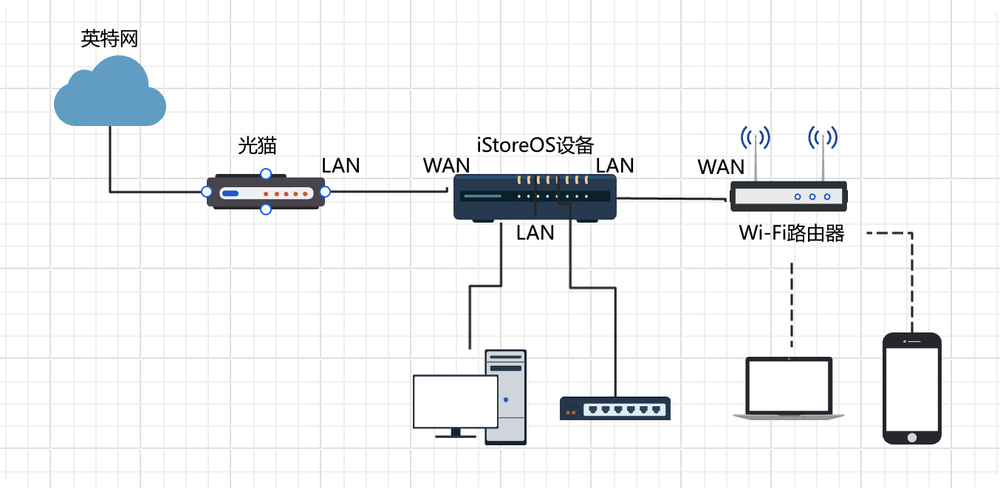

根据使用场景将设备接入到现有网络中，将iStoreOS设备作为主路由、旁路由或纯主机使用。

## 根据网口数量选择模式

### 1. 设备网口数量为1个

如果您的iStoreOS设备只有一个网口，无法同时连接外部网络和内部设备，因此只能选择以下两种模式：

- 旁路由模式：辅助主路由，提供附加功能（如上网管理、流量管理等）。
- 纯主机模式：作为一个普通的网络客户端，接入现有网络使用。

### 2. 设备网口数量大于1个

如果您的iStoreOS设备有多个网口（例如2个或更多），则可以灵活选择以下三种模式：

- 主路由模式：替代现有路由器，负责整个网络的连接和管理。
- 旁路由模式：辅助主路由，提供附加功能（如上网管理、流量管理等）。
- 纯主机模式：作为一个普通的网络客户端，接入现有网络使用。

## 接线与配置教程

### 1. 网口数量为1个的情况

- **旁路由模式**

接线方式：

将唯一的网口连接到现有网络的交换机或主路由器的LAN口。

接线后请查看如何[访问设备](/zh/guide/istoreos/network/check_connection.html)

- **纯主机模式**

接线方式：

将唯一的网口连接到现有网络的交换机或主路由器的LAN口。

接线后请查看如何[访问设备](/zh/guide/istoreos/network/check_connection.html)

### 2. 网口数量大于1个的情况

- **主路由模式**

接线方式：

将第一个网口（设定为WAN口）连接到外部网络（如光猫、调制解调器）。
将其余网口（LAN口）连接到内部网络设备（如无线路由器、电脑、交换机等）。

接线后请查看如何[访问设备](/zh/guide/istoreos/network/check_connection.html)

- **旁路由模式**

接线方式：

将LAN口连接到现有网络的交换机或主路由器的LAN口。

接线后请查看如何[访问设备](/zh/guide/istoreos/network/check_connection.html)

- **纯主机模式**

接线方式：

将WAN口连接到现有网络的交换机或主路由器的LAN口。
其他网口可连接内部设备，但通常不使用。

接线后请查看如何[访问设备](/zh/guide/istoreos/network/check_connection.html)

### 总结

1个网口

- 旁路由：连接主网络，配置静态IP，禁用DHCP。
- 纯主机：连接主网络，启用DHCP客户端。

多个网口

- 主路由：WAN口接外部网络，LAN口接内部设备，配置WAN接入方式和LAN DHCP。
- 旁路由：一个网口接主网络，配置静态IP，禁用DHCP，其他网口可选配置。
- 纯主机：一个网口接主网络，启用DHCP客户端，其他网口可选配置。